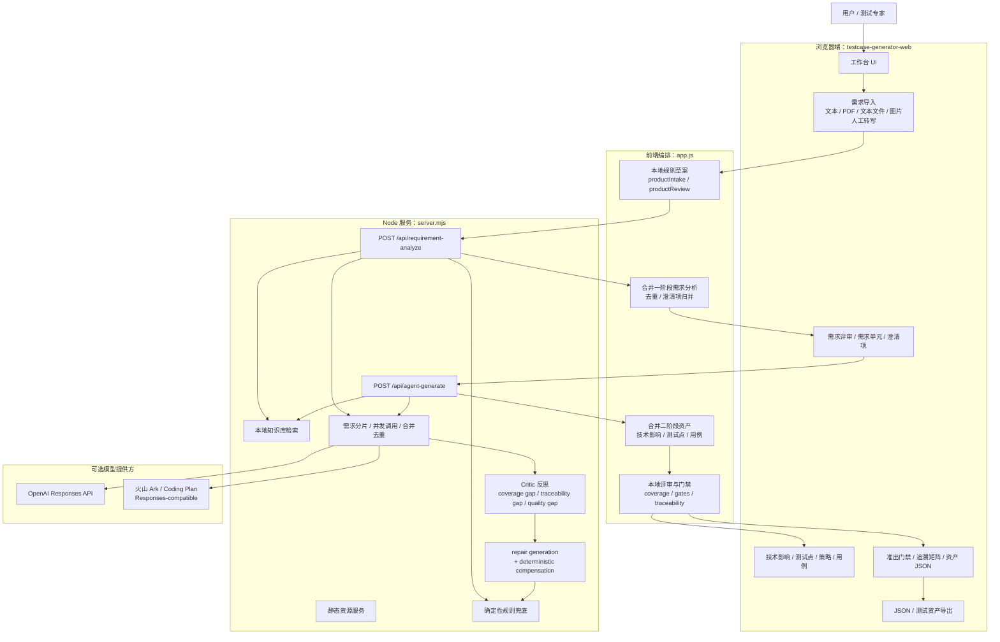
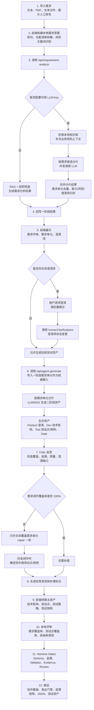
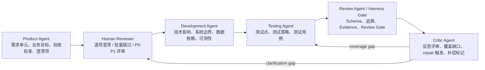
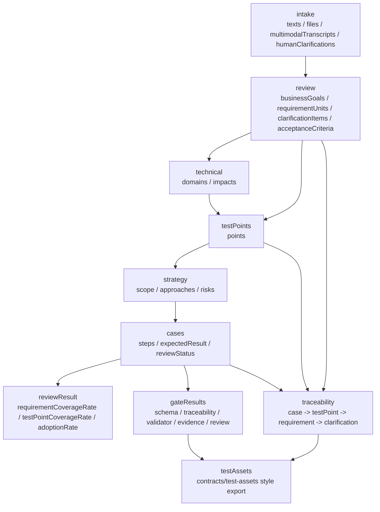
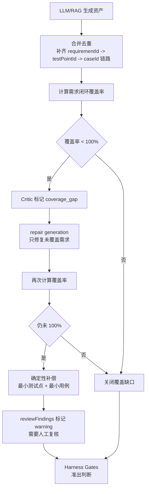

# 测试用例自动生成工具工作流

## 结论

当前工具采用“两阶段 LLM/RAG + Harness 规则兜底”的测试开发工作流：

```text
一阶段：需求导入 -> 需求单元拆分 -> 待澄清项 -> 人工澄清/跳过
二阶段：技术影响 -> 测试点 -> 测试用例 -> Critic 反思 -> 修复/补偿 -> 门禁/追溯/导出
```

它的核心不是直接执行测试，而是把需求文档转成可评审、可追溯、可门禁的测试开发资产。

## 总体架构



## 端到端流程



## Agent 分工



## 两阶段接口边界

| 阶段 | 入口 | 输入 | 输出 | 关键约束 |
|---|---|---|---|---|
| 需求分析 | `POST /api/requirement-analyze` | 原始 intake、本地规则草案、RAG 知识 | `requirementAnalysis`、`analysisSummary`、Product 侧澄清项 | 只做需求解析，不生成最终测试用例 |
| 资产生成 | `POST /api/agent-generate` | 一阶段 `review.requirementUnits`、人工澄清、RAG 知识 | `agentGeneratedAssets`、`generationSummary`、`agentReflectionFindings` | 不重新返回 `requirementAnalysis`，一阶段需求单元是权威输入 |

## 数据对象流转



## 质量闭环



## 当前工作流特点

- 需求分析和资产生成被明确拆成两阶段，避免“生成后续资产”时重新覆盖一阶段需求拆分结果。
- 二阶段以一阶段 `requirementUnits` 为权威输入，服务端 prompt 明确要求不重新做需求分析。
- 待澄清项在一阶段后展示，用户可以逐项提交，也可以批量跳过；后续资产生成会读取人工补充。
- LLM 失败、无 Key 或分片失败时会退回 RAG + 规则链路，保证工具可用。
- Critic 负责发现覆盖、追溯、质量和澄清缺口；覆盖不足时先 repair，再用确定性补偿兜底。
- 前端最终仍会做本地 review、quality gates、traceability 和资产导出，避免直接把 LLM 输出当成可准出资产。

